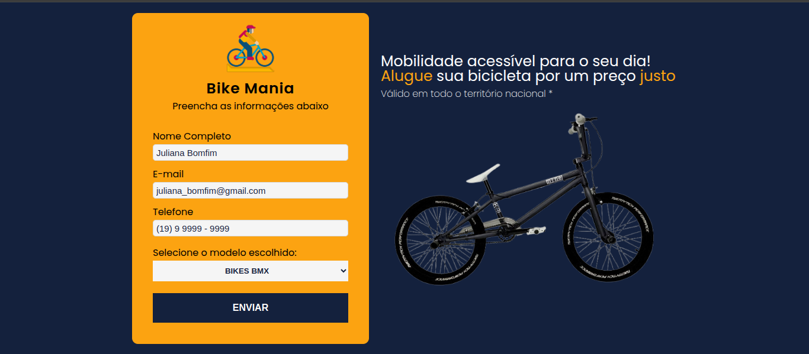

# Formulário - Alugar Bike

# 🚴 Formulário de Interesse para Aluguel de Bikes

Este projeto é uma página web simples desenvolvida em **HTML** e **CSS** para capturar o interesse de usuários que desejam alugar bicicletas. O objetivo é oferecer uma interface amigável e responsiva para que os interessados possam enviar suas informações de contato.

## ✨ Tecnologias Utilizadas
- HTML5
- CSS3

## 📸 Captura de Tela



## 🚀 Como Usar
1. Clone este repositório:
   ```bash
   git clone https://github.com/oliverassis00/formulario_alugar_bike.git
   ```
2. Abra o arquivo `index.html` no seu navegador.

## 📌 Funcionalidades
- Formulário para captura de nome, email e telefone.
- Design responsivo para dispositivos móveis.
- Botão de envio estilizado.

## 🎨 Estilização
O design da página foi feito utilizando apenas CSS puro, focando na simplicidade e na experiência do usuário.

## 🔧 Melhorias Futuras
- Adicionar validação de campos com JavaScript.
- Implementar integração com backend para armazenar os dados.
- Melhorar a acessibilidade da página.

## 📄 Licença
Este projeto está sob a licença MIT - veja o arquivo [LICENSE](LICENSE) para mais detalhes.

---
Desenvolvido com 💙 por [Oliver Assis](https://github.com/oliverassis00)


